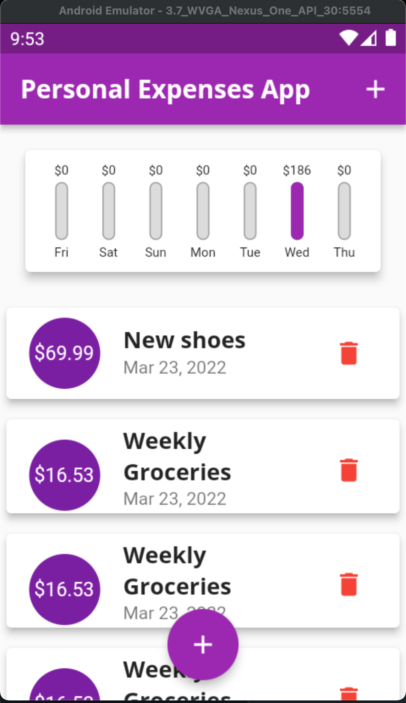

# PersonalExpense Flutter App

This application shows a basic expense sheet with a bar chart.

## Features
- Dart
- Material Dart widgets 
## General Demo

|  Plattform |   |
|---|---|
|  web |   |
|  Android |   |
|  iOS |   |

## Responsive vs Adaptative

As you may know, Flutter framework promote to have responsives UI (That adapts diferent sizes and orientations) and also promote adaptatives UI ( that are able to change according to the platform styles and UI behaviors)

<table>
    <thead>
        <tr>
            <th colspan=3>Responsive Example on Androd Nexus ONE 3.2" Portrait & landscape</th>
        </tr>
    </thead>
    <tbody>
        <tr>
            <td></td>
            <td></td>
            <td></td>
        </tr>
    </tbody>
</table>

<table>
    <thead>
        <tr>
            <th>Adaptative Example on iOS</th>
        </tr>
    </thead>
    <tbody>
        <tr>
            <td></td>
        </tr>
    </tbody>
</table>
